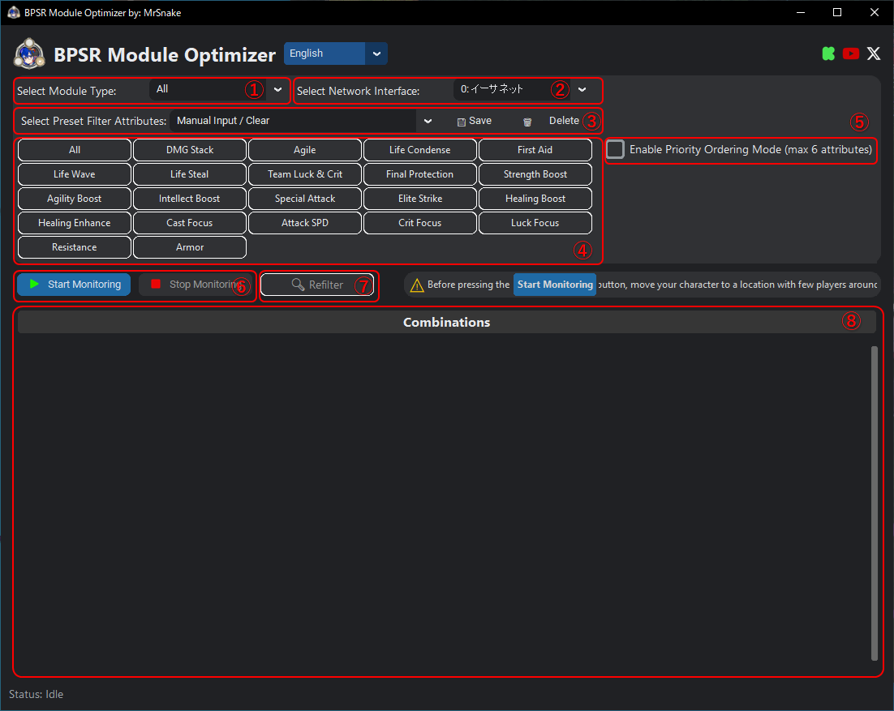
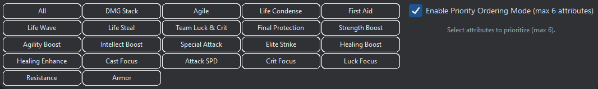
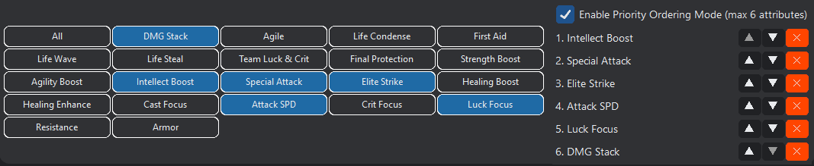
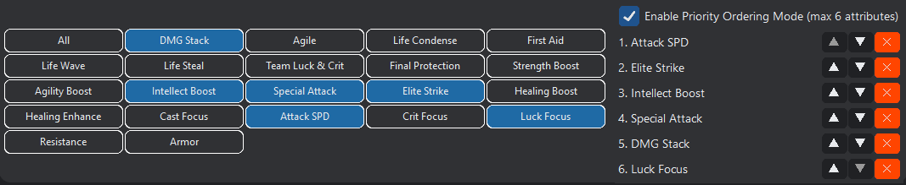
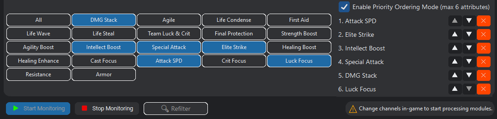
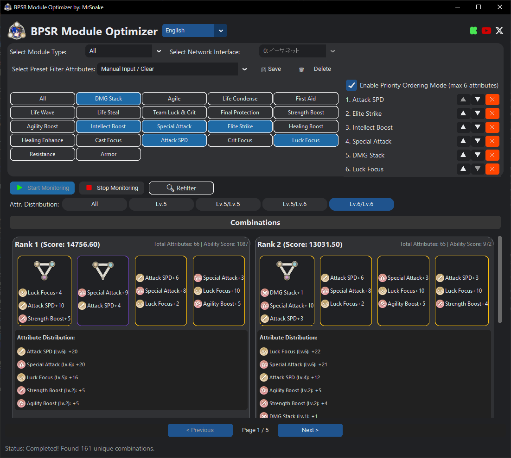
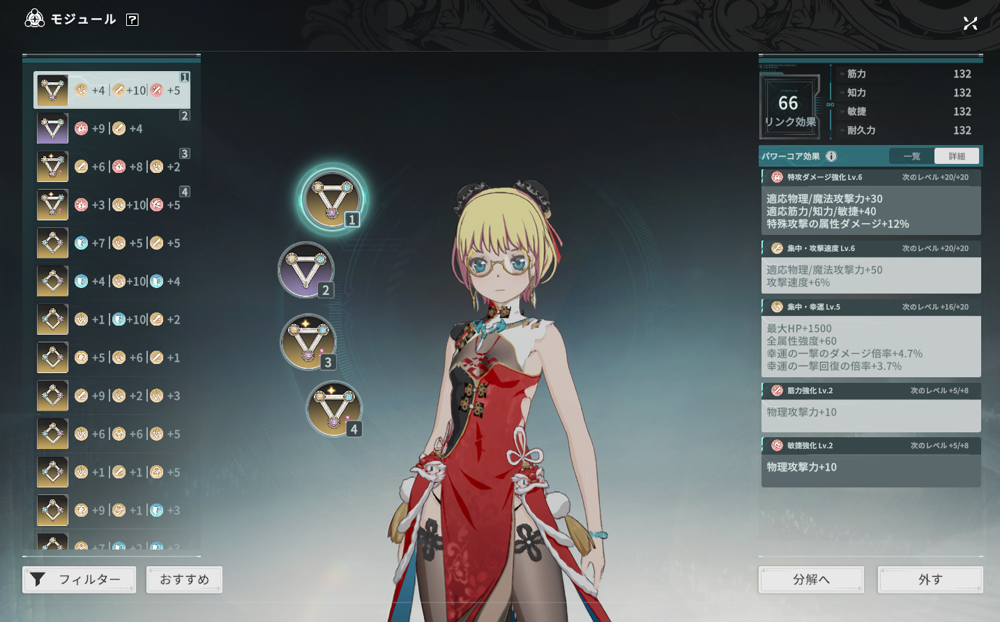
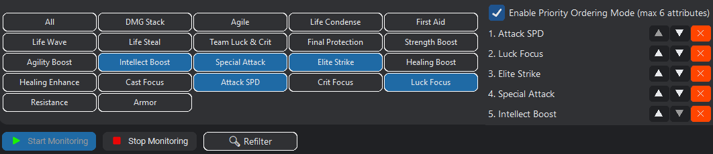
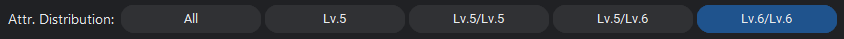

# BPSR Module Optimizer 解説
MrSnake氏作のツール「BPSR Auto Modules — Module Optimizer」の日本語解説記事です。  
ツール本体の配布はこちら→ https://github.com/mrsnakke/BPSR-AutoModules/  
## 何するツール？
手持ちのモジュールから、よさげな組み合わせを自動で選択してくれるツールです。  
## ダウンロード・インストール
配布元のReadmeを読んでインストールしてください。(英語読めない人は翻訳使ってね)  
https://github.com/mrsnakke/BPSR-AutoModules/blob/Main/README.md  
## 画面各部位の機能説明
  
① Select Module Type  
- 検索対象のモジュールタイプを指定します。
- プルダウンで以下から選択します。
  - All (すべて)
  - Attack (攻撃)
  - Guard (防御)
  - Support (支援)
  
② Select Network Interface  
- スタレゾの通信に使用しているネットワークアダプタを指定します。
- 基本的には、インターネットに接続しているネットワークアダプタを指定すればOK。
  
③ Select Preset Filter Attributes  
- 組み合わせに使用するパワーコア効果のプリセット選択・プリセット保存・プリセット削除を行います。
- クラス別のプリセットが選択できます。
- オリジナルのプリセットも保存できるようですが、筆者の環境では保存できませんでした。
- 優先度までロードしたい場合は、先に「Enable Priority Ordering Mode」のチェックを入れてから、プリセットをプルダウンから選択してください。
  
④ 組み合わせに使用したいパワーコア効果を選択します。  
- 選択できるパワーコア効果は以下の通り。

効果(英名)|効果(和名)
-|-
All|すべて
DMG Stack|極・ダメージ増強
Agile|極・適応力
Life Condense|極・HP凝縮
First Aid|極・応急処置
Life Wave|極・HP変動
Life Steal|極・HP吸収
Team Luck & Crit|極・幸運会心
Final Protection|極・絶境守護
Strength Boost|筋力強化
Agility Boost|敏捷強化
Intellect Boost|知力強化
Special Attack|特効ダメージ強化
Elite Strike|精鋭打撃
Healing Boost|マスタリー回復強化
Healing Enhance|特効回復強化
Cast Focus|集中・詠唱
Attack SPD|集中・攻撃速度
Crit Focus|集中・会心
Luck Focus|集中・幸運
Resistance|魔法耐性
Armor|物理耐性
  
⑤ Enable Priority Ordering Mode  
- 組み合わせに使用するパワーコア効果の優先度を設定します。
- ここにチェックを入れてから、④のパワーコア効果をクリックすると、優先順のリストに追加されます。(6つまで)
- このチェックボックスは、③④を操作する前にONにしないとうまく動作しません。
  
⑥ Start Monitoring / Stop Monitoring  
- パケット監視のON/OFFを制御します。
- パケット監視がONの状態でch移動を行うと、自信の所持するモジュールを読み込み、設定したパワーコアの組み合わせを探索し始めます。
  
⑦ Refilter  
- パワーコア効果の選択や優先度を変更した際に、組み合わせの再探索を指示します。
  
⑧ 指定した条件を満たすモジュールを表示するエリア  
- 設定したパワーコア効果の種類と優先度を可能な限り満たすモジュールの組み合わせが表示されます。
  
## 具体的な使用例
実際にツールを使用してモジュールの組み合わせを探してみます。
1. Enable Priority Ordering Mode にチェックを入れる

1. 希望するパワーコア効果を選択する

1. Enable Priority Ordering Mode のチェックボックスの下に、選択したパワーコア効果が追加されるので、▲▼ボタンを押下して優先順を編集する

1. を押下し、パケットモニタリングを開始する
1. 以下のような状態になるので、ゲーム内でch移動を行う  
※ギルドルームやホームへの移動でもOK

1. 以下のメッセージが表示されるので、結果が表示されるまで待つ  
※そこそこ時間がかかります  

1. 探索結果が表示されるので、提示された候補の中から好きなものを選んでゲーム内で同じモジュールを探して設定する  
※指定したパワーコア効果のモジュールを所持していても、所持しているモジュールを組み合わせた結果、効果値の合計値が低くなってしまう場合は優先度通りにならない場合があります
  

  
## 条件を変更して再探索する
1. パワーコア効果の種類と優先度を変更する

1. (オプション)希望するパワーコア効果のレベルを設定する  
※優先順1位と2位のみ可能です。基本的にLv.6/Lv.6でいいと思います

1. を押下すると再探索が始まるので、結果が表示されるまで待つ

## 注意事項
- この記事に関する質問等を、開発者(MrSnake氏)に向けて行わないでください。
- このツールには、ゲームの通信内容を解析する動作が組み込まれています。  
現在、日本サーバーの規約では、<u>**公平性を欠くようなツールの使用はNG**</u>だと明言されています。  
このツールがそのようなツールに当たるかどうかは公式から明言されていない(おそらく今後もされることはない)ため、使用に当たっては自己責任とし、このツールで負ったあらゆる不利益に関して、私は責任を負いません。